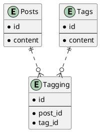

# データベース設計のアンチパターンを学ぶ2

## 課題1

- 3つtagカラムがある場合、すべてのpostで必ず3つ設定しないと、テーブルにNULLが入ってしまう
- タグの数を増やすことになった場合、既存のすべてのpostにNULLのタグが入ることになってしまう

## 課題2

```plantuml
@startuml
entity Posts {
  * id
  --
  * content
}

entity Tagging {
  * id
  --
  * post_id
  * tag_id
}

entity Tags {
  * id
  --
  * content
}

Posts ||..o{ Tagging
Tags ||..o{ Tagging
@enduml
```
