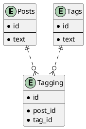

# データベース設計のアンチパターンを学ぶ1

## 課題1

- `tags`から取得したデータを利用するために、アプリケーション側で配列などに変換する処理を挟まなければならない
- データを登録する際にも、アプリケーション側でロジックが必要になる
- 名前にカンマが入ったタグを設定できない
- 検索がしにくい
  - 「tagCが含まれるPost」など

## 課題2

## 疑問

- 中間テーブルの命名、[安直に「複数形_複数形」みたいにするのは微妙](https://qiita.com/tkawa/items/dc3e313021f32fd91ca6)みたいなのがあって、たしかにそうかも？と思ったが実際どうなのか（テーブル増えてきたら相当めんどくさそうだなとは思う）
- Taggingが特定できるようにidふったが、果たして本当に必要なのか
