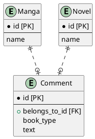
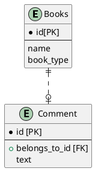

# データベース設計のアンチパターンを学ぶ3

## 課題1

- Manga_idなのかNovel_idなのかわからない
  - Manga_idとNovel_idを重複しないように設定すれば問題ない？
    - マンガは`m_001`、小説は`n_001`とかにする
    - そうした場合、コメントを取得→漫画か小説か判定するロジックが必要になる
    - どちらでもないデータを取り除くバリデーションなどのロジックが必要になる

## 課題2

### 回答1

Commentに`book_type`を設ける。`manga`や`novel`といった種別を設定することで、何に対するコメントなのか識別できる。

### 回答2

MangaとNovelを一体にしてBooksとし、`book_type`を設ける。

## 疑問

一体にするの、アリなのか。既に動いているサービスを改修するというシチュエーションを考えると、アプリケーション側の修正がえげつなくなりそう。
