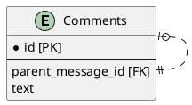
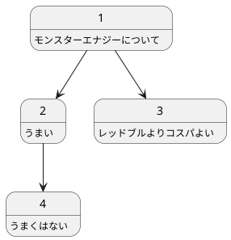
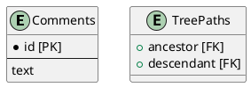
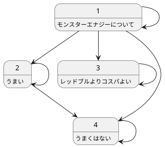

# データベース設計のアンチパターンを学ぶ4

## 課題1



Comments

| id | parent_message_id | text |
| - | - | - |
| 1 | NULL | モンスターエナジーについて |
| 2 | 1 | うまい |
| 3 | 1 | レッドブルよりコスパよい |
| 4 | 2 | うまくはない |



特定のスレッドの子を全て取得しようとした場合、1回のクエリで決まった階層の深さのスレッドしか取得できない。

この場合、id=1のスレッドの子を取得する場合、以下のようなクエリが必要になる。

2階層取得する場合

```sql
SELECT c1.*, c2.*
FROM Comments c1
  LEFT OUTER JOIN Comments c2
  ON c1.parent_message_id = c2.parent_message_id
```

3階層取得する場合

```sql
SELECT c1.*, c2.*, c3.*
FROM Comments c1
  LEFT OUTER JOIN Comments c2
  ON c1.parent_message_id = c2.parent_message_id
  LEFT OUTER JOIN Comments c3
  ON c2.parent_message_id = c3.parent_message_id
```

「何階層あっても全て取得したい」というクエリが書けない。

また、コメントの削除も容易ではない場合がある。木構造の葉の部分にあたるコメントはかんたんに削除できるが、葉以外のコメントを消す場合はそのコメントの子にあたるコメントも削除しなければならない。子をすべて削除するという操作は、子をすべて取得するクエリを書けない場合と同じ理由で、単一のクエリで表現できない。

## 課題2

閉包テーブルモデルと呼ばれる方法を利用する。`TreePaths`テーブルを用意し、先祖（ancestor）と子孫（descendant）の組み合わせと自分自身を参照する行を格納する。



Comments

| id | text |
| - | - |
| 1 | モンスターエナジーについて |
| 2 | うまい |
| 3 | レッドブルよりコスパよい |
| 4 | うまくはない |

TreePaths

| ancestor | descendant |
| - | - |
| 1 | 1 |
| 1 | 2 |
| 1 | 3 |
| 1 | 4 |
| 2 | 2 |
| 2 | 4 |
| 3 | 3 |
| 4 | 4 |

例えばid=1のコメントには子孫として2, 3, 4があるので、それを表現する行1-2, 1-3, 1-4と、自分自身を参照する1-1を追加している。id=3と1d=4は子孫がいない孤独な存在なので、自分自身を参照する3-3, 4-4のみ。図にすると以下のようになる。



id=1のスレッドの子を全て取得したい場合、以下のクエリを実行する。

```sql
SELECT c.*
FROM Comments AS c
  INNER JOIN TreePaths AS t
  ON c.id = t.descendant
WHERE t.anceestor = 1;
```

id=2のコメントと、そのスレッドの子をすべて削除する場合は、以下のクエリを実行する。

```sql
DELETE FROM TreePaths WHERE descendant = 2;
```
