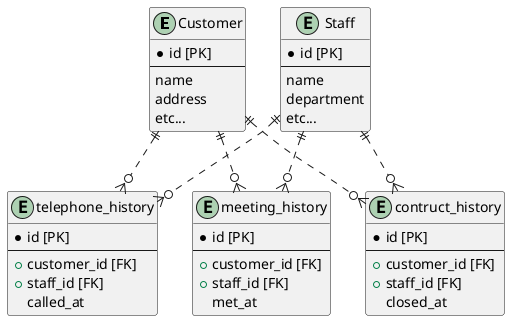

# 【回答】データベース設計のアンチパターンを学ぶ5

## 課題1

- `metAt`、`closedAt`は、`metOnce`や`closed`がfalseの場合は必ずNULLになってしまう
- 1回電話をかけたかどうか、1回面談をしたかどうか、という情報しか管理できない
- `NewCustomer`というテーブル名が適切でない
  - 面談も成約も完了した顧客は新規顧客ではなくなる
- 様々な顧客の様々な営業ステータスをNewCustomerテーブルだけで管理するのは、負荷が集中しそう

## 課題2

以下の基準でテーブルを分割する。

- データベースでは状態の管理はしない
  - 整合性を保ちながらデータを更新するのは大変だから
- イベントの履歴のみ記録する
  - 履歴から状態を導出できるようにするのはアプリケーションの責務にする
  - 顧客単位の営業ステータスがわかりやすいようなビューを作ってあげてもいいかもしれない

