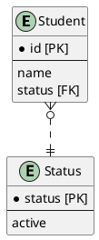

# データベース設計のアンチパターンを学ぶ6

## 課題1

- ステータスとして設定できる選択肢一覧をクエリで取得する方法がない
  - 常にアプリケーション側で持つリストと手動で同期する必要がある
- 新しい選択肢を追加しにくい
  - 既にある選択肢の中に新しい選択肢を追加するのではなく、既にある選択肢も含めた新しい組み合わせを作ってまるっと上書きしなければいけない※
- 選択肢の値の変更が困難
  - 既存のデータの書き換えが不可能な場合がある
- 移植が困難
  - check制約まわりはRDBMSによって定義方法がまちまちらしい

※うまく日本語で書けなかったのでTypeScriptでのイメージ

```typescript
let status = ["studying", "graduated", "suspended"]

// 理想的な追加の仕方（イメージ）
status.push("withdrawal")

// SQLでcheck制約を変更するには…（イメージ）
status = ["studying", "graduated", "suspended", "withdrawal"]
```

## 課題2

ステータスを値として管理するテーブルを用意して参照させる。



- 選択肢の取得や選択肢の追加はふつうにSELECTやINSERTすればよい
- 選択肢の値を更新する場合も、外部キーに`ON UPDATE CASCADE`オプションを追加して宣言すれば問題ない
- 選択肢を削除したい場合、外部キーを設定しているため通常の削除はできない
  - activeなどのbooleanのカラムを設定して、廃止された値か否かを設定すればよい
