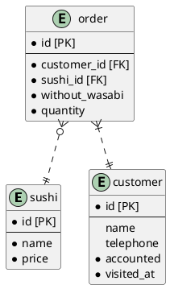
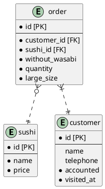
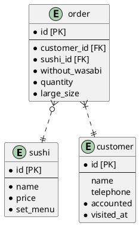
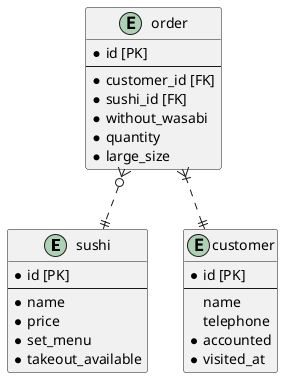

# DBモデリング1

## 課題1

以下のテーブルを用意する。

- 寿司ネタやセットメニューの情報を格納する`sushi`テーブル
- 注文表を書いたお客さんに関する情報を格納する`customer`テーブル
- 注文に関する情報を格納する`order`テーブル

注文ごとの情報を取得する場合は、`order`テーブルのレコードを`customer_id`で絞り込んで取得する。
customerテーブルの`name`と`telephone`については、お客さんが注文表に書いてくれなかった場合を考えてNULL許容にしている。

## 課題2

### シャリの大小を選べるようにする

`order`テーブルにシャリを大にするかどうかのbooleanを設定するカラム`large_size`を追加する。

### 寿司ネタの売上を集計できるようにする

`sushi`テーブルにセットメニューかどうかのbooleanを設定するカラム`set_menu`を追加する。

## 課題3

### 今後発生しそうな追加仕様

貝類などの持ち帰りができない商品を分類したい場合。

  
回答

  `sushi`テーブルに、持ち帰り可能な商品かどうかのbooleanを設定するカラム`takeout_available`を設定する。

