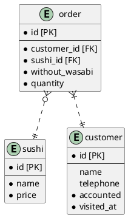

# DBモデリング1

## 課題1

```plantuml
@startuml
Entity sushi {
  *id [PK]
  --
  *name
  *price
}

Entity customer {
  *id [PK]
  --
  name
  telephone
  *accounted
  *visited_at
}

Entity order {
  *id [PK]
  --
  *customer_id [FK]
  *sushi_id [FK]
  *without_wasabi
  *quantity
}

order }o..|| sushi
order }|..|| customer

@enduml
```

## 課題2

## 課題3
