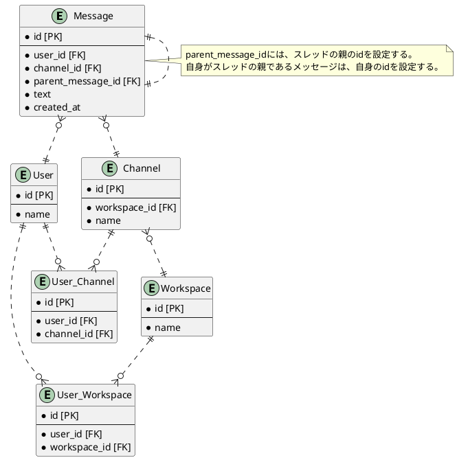

# DBモデリング2

## 課題1

### UML図



### 操作

#### メッセージ、スレッドメッセージ、チャネルの取得

特定のユーザーが所属しているワークスペース一覧を取得するクエリ

```sql
SELECT *
FROM
  Workspace
  INNER JOIN User_Workspace
    ON Workspace.id = User_Workspace.workspace_id
WHERE User_Workspace.user_id = [user_id];
```

特定のワークスペースからチャンネルの一覧を取得するクエリ

```sql
SELECT *
FROM Channel
WHERE workspace_id = [workspace_id];
```

特定のチャンネルのスレッドの一覧を取得するクエリ

```sql
SELECT *
FROM Message
WHERE
  channel_id = [channel_id]
  AND parent_message_id = id;
```

特定のスレッドに属するメッセージの一覧を取得するクエリ

```sql
SELECT *
FROM Message
WHERE parent_message_id = [parent_message_id];
```

#### ユーザーの操作

ワークスペースにユーザーを追加・脱退させる場合は`User_Workspace`に`INSERT`、`DELETE`する。
チャンネルにユーザーを追加・脱退させる場合は`User_Channel`に`INSERT`、`DELETE`する。

#### 横断機能

参加しているチャンネル内からメッセージを検索するクエリ

```sql
SELECT *
FROM Message
WHERE
  Message.channel_id =
    (
      SELECT User_Channel.channel_id
      FROM User_Channel
      WHERE User_Channel.user_id = [user_id]
    )
  AND [検索クエリ]
```

## 疑問

ちょっとした操作でめちゃくちゃデカいデータ触らないといけないのでめちゃくちゃ遅そうな気がする…。
