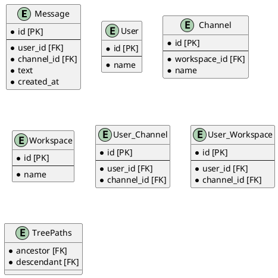

# DBモデリング2

## 課題1

```plantuml
@startuml

Entity Message {
  *id [PK]
  --
  *user_id [FK]
  *channel_id [FK]
  *text
  *created_at
}

Entity User {
  *id [PK]
  --
  *name
}

Entity Channel {
  *id [PK]
  --
  *workspace_id [FK]
  *name
}

Entity Workspace {
  *id [PK]
  --
  *name
}

Entity User_Channel {
  *id [PK]
  --
  *user_id [FK]
  *channel_id [FK]
}

Entity User_Workspace {
  *id [PK]
  --
  *user_id [FK]
  *channel_id [FK]
}

Entity TreePaths {
  *ancestor [FK]
  *descendant [FK]
}
@enduml
```
