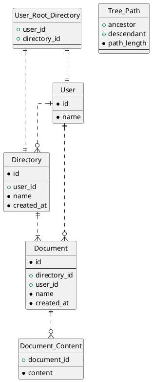

# DBモデリング3

## 課題1

### ER図



### ユースケース

#### ドキュメントの操作

##### ドキュメントの作成

`Document`テーブルにレコードをinsertする。Documentの内容は`Document_Content`にinsertする。

##### ドキュメントの参照

`User`の`id`と紐付くルートディレクトリを、`User_Root_Directory`から取得する。ドキュメントは、`Document`から`directory_id`で絞り込んで取得、参照する。

##### ドキュメントの更新

更新したいドキュメントのidを持つ`Document_Content`の`content`をupdateする。

##### ドキュメントの削除

削除したいドキュメントの`Document_Content`を削除してから、`Document`を削除する。

##### ドキュメントの移動

移動したいドキュメントの`directory_id`を更新する。

#### ディレクトリの操作

##### ディレクトリの作成

`Directory`にレコードをinsertして、`Tree_Path`に先祖・子孫・子孫から先祖までの距離を持つレコードを挿入する。以下のようなクエリになる。[id]が挿入するディレクトリのidで、[target_id]が挿入する先のディレクトリのid

```sql
INSERT INTO Directory (id, user_id, name, created_at)
VALUES ([id], [user_id], [name], [created_at]);

INSERT INTO Tree_Path (ancestor, descendant, path_length)
  SELECT Tree_Path.ancestor, [id], Tree_Path.path_length + 1
  FROM Tree_Path
  WHERE Tree_Path.descendant = [target_id]
UNION ALL
  SELECT [id], [id], 0;
```

##### ディレクトリの参照

特定のディレクトリ配下のディレクトリを参照するには、`Tree_Path`から以下のクエリでディレクトリのidを取得する。

```sql
SELECT descendant
FROM Tree_Path
WHERE
  ancestor = [id]
  path_length = 1
```

##### ディレクトリの更新

`Directory`の`name`をupdateする。

##### ディレクトリの削除

以下のクエリで、削除するディレクトリの子孫を子孫として参照するすべての行を`Tree_Path`から削除する。

```sql
DELETE FROM Tree_Path
WHERE descendant
  IN (
    SELECT x.id
    FROM (
      SELECT descendant AS id
      FROM Tree_Path
      WHERE ancestor = [id]
    ) AS x
  )
```

##### ディレクトリの移動

まず対象のディレクトリの子孫を子孫として参照するすべての行を`Tree_Path`から削除する。その後、対象のディレクトリと対象のディレクトリを先祖として参照する行をうまいこと挿入する。

```sql
DELETE FROM Tree_Path
WHERE
  descendant IN (
    SELECT x.id
    FROM (
      SELECT descendant AS id
      FROM Tree_Path
      WHERE ancestor = [id]
    ) AS x
  )
  AND ancestor IN (
    SELECT y.id
    FROM (
      SELECT ancestor AS id
      FROM Tree_Path
      WHERE
        descendant = [id]
        AND ancestor != descendant
    ) AS y
  );

INSERT INTO Tree_Path (ancestor, descendant, path_length)
  SELECT super.ancestor, sub.descendant, super.path_length + sub.path_length + 1
  FROM
    Tree_Path AS super
    CROSS JOIN Tree_Path AS sub
  WHERE
    super.descendant = [target_id]
    AND sub.ancestor = [id]
```

## 疑問（？）

- ユーザーのルートディレクトリをささっと取得する方法がわからなかったのでテーブル作ってしまったが、筋悪か
- ディレクトリの操作、閉包テーブルの使い方いろいろ調べて書いてみたものの、理解できてない
