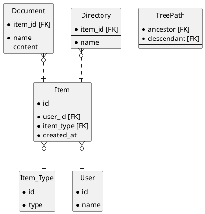

# DBモデリング3

## 課題1

```plantuml
@startuml

hide circle
skinparam linetype ortho

Entity Item {
  *id
  --
  *user_id [FK]
  *item_type [FK]
  *created_at
}

Entity Item_Type {
  *id
  --
  *type
}

Entity Document {
  *item_id [FK]
  --
  *name
  content
}

Entity Directory {
  *item_id [FK]
  --
  *name
}

Entity User {
  *id
  --
  *name
}

Entity TreePath {
  *ancestor [FK]
  *descendant [FK]
  --
}

Item }o..|| Item_Type
Item }o..|| User
Document }o..|| Item
Directory }o..|| Item

@enduml
```
