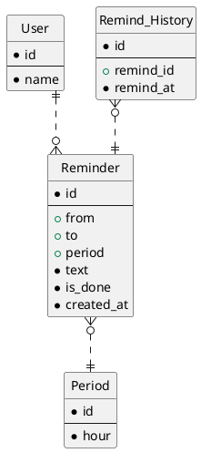

# DBモデリング4

## 課題1

```plantuml
@startuml

hide circle
skinparam linetype ortho

Entity User {
  *id
  --
  *name
}

Entity Reminder {
  *id
  --
  +from
  +to
  +period
  *text
  *is_done
  *created_at
}

Entity Period {
  *id
  --
  *hour
}

Entity Remind_History {
  *id
  --
  +remind_id
  *remind_at
}

User ||..o{ Reminder
Reminder }o..|| Period
Remind_History }o..|| Reminder

@enduml
```
