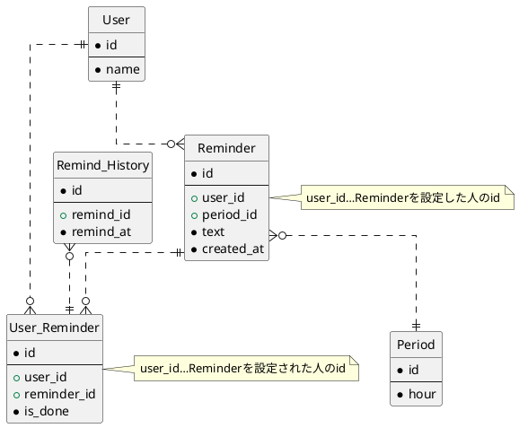

# DBモデリング4

## 課題1

### ER図

### ユースケース

#### リマインダーを設定する

1. Reminderにレコードをinsertする。リマインドする頻度はPeriodテーブルから取得する。
2. User_Reminderにレコードをinsertする。is_doneはfalseを設定する。

#### リマインドする

1. User_Reminderからis_doneがfalseのレコードを取得する。
2. Remind_Historyに同じremind_idが1件以上登録されていた場合、Remind_Historyのremind_atとPeriodのhourから次のリマインド時間を計算する。Remind_Historyに同じremind_idが1件も登録されていなかった場合、Reminderのcreated_atとPeriodのhourから次のリマインド時間を計算する。
3. リマインドしたら、Remind_Historyにレコードをinsertする。

#### タスクを完了させる

1. User_Reminderのis_doneをtrueにする。
2. reminder_id→Reminder.user_idで完了報告をするユーザーを特定する。

#### 自分宛てのタスク一覧を取得する

User_Reminderから、user_idで絞り込んでレコードを取得する。完了済みのものを表示しない場合はさらにis_doneで絞り込む。

#### 自分が設定したタスク一覧を取得する

Reminderからuser_idで絞り込んでレコードを取得する。

#### 配信頻度のパターンを増やす

Periodにレコードをinsertする。1時間単位で設定する。例えば2週間に1度であれば336を設定する。
