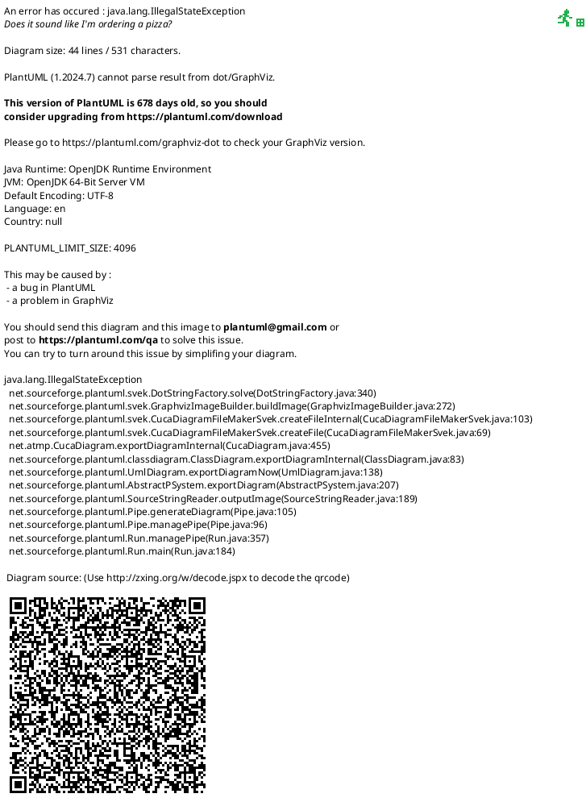

# DBモデリング4

## 課題1

### ER図

### ユースケース

#### リマインダーを設定する

1. Reminderにレコードをinsertする。periodにはリマインドする周期を1時間単位の整数で設定する。
2. User_Reminderにレコードをinsertする。reminder_idには1. でinsertしたReminderのid、user_idにはリマインドを送るUserのid、is_doneにはfalseを設定する。
3. Reminder_Scheduleにレコードをinsertする。remind_atにはcreated_atとperiodから計算した時間（未来日）を設定する。

#### リマインドする

毎時行われる以下のバッチ処理でリマインドされる。

1. Remind_Scheduleから、バッチを実行した時刻と同一の時刻のレコードを取得する。
2. 取得したレコードからリマインドの内容とユーザーをたどってuser_idを取得する。
3. User_Reminderのis_doneがfalseのユーザーにリマインドする。
4. リマインド後、Reminder_Scheduleにレコードをinsertする（次回のリマインド予定）。remind_atには前回のremind_atとperiodから計算した日時を設定する。

#### タスクを完了させる

1. User_Reminderのis_doneをtrueにする。
2. reminder_id→Reminder.user_idで完了報告をするユーザーを特定する。

#### 自分宛てのタスク一覧を取得する

User_Reminderから、user_idで絞り込んでレコードを取得する。完了済みのものを表示しない場合はさらにis_doneで絞り込む。

#### 自分が設定したタスク一覧を取得する

Reminderからuser_idで絞り込んでレコードを取得する。

#### 配信頻度のパターンを増やす

配信頻度はアプリ側で1時間単位で設定してReminder.periodに設定する。（結局パーサーで処理する必要があるので、データベース側では頻度の設定は持たない方針）
