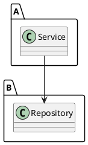
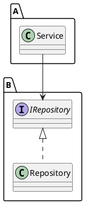
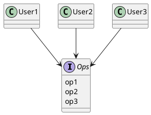
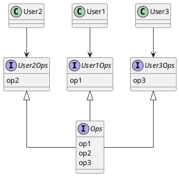
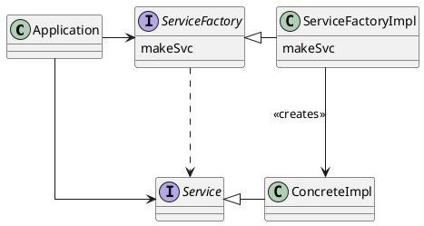

# 設計原則（SOLID）

## SOLID原則とは

SOLID原則とは、以下のような性質を持つ中間レベルのソフトウェア構造を作ることを目的とした設計原則である。

- 変更に強いこと
- 理解しやすいこと
- コンポーネントの基盤として、多くのソフトウェアシステムで利用できること

中間レベルのソフトウェア構造とは、関数やデータ構造をどのようにクラスに組み込むのか、クラスの相互接続をどのようにするのか、などの取り決めのこと。

Robert C. Martinにより提唱された多数のソフトウェア設計の原則を整理して5つにまとめたものの頭文字をとってSOLIDと名付けられた。

### S … Single Responsibility Principle: 単一責任の原則

個々の部品が責任を負う対象は、たったひとつになるようにするべきであるという原則。つまり、将来その部品を改修することになったとして、改修する理由が複数考えられる場合は複数の対象に責任を負っていることになるので、たった一つの対象に責任を負うように部品を適切に分割する必要があるということ。

例えば、以下のような`Employee`クラスはSRPに違反しているといえる。

```typescript
class Employee {
  ...
  public calculatePay(): Money {...};
  public reportHours(): string {...};
  public save(): void {...};
  ...
}
```

- calculatePay … 経理部門が規定する、給与計算のメソッド
- reportHours … 人事部門が規定する、労働時間レポートを出力するメソッド
- save … データベース管理者が規定する、従業員情報をDBに保存するメソッド

このクラスは、給与計算に関わるビジネスルールの変更、レポートのフォーマットの変更、データベーススキーマの変更のどれかがあるたびに変更を加える必要がある。このとき、給与計算に関わるビジネスルールが変更されただけなのにレポートの出力が影響を受ける可能性があるなどの問題がある。また、`Employee`に依存するクラスもすべてこれらの変更に影響される可能性がある。

この問題を解決するには、以下のように。責任ごとにクラスを適切に分割すれば良い。

```typescript
class Employee {
  public calculatePay(): Money {...};
}

class EmployReporter {
  public reportHours(e: Employee): string {...};
}

class EmployeeRepository {
  public save(e: Employee): void {...};
}
```

### O … Open-Closed Principle: 開放閉鎖の原則

ソフトウェアを変更しやすくするために、ソフトウェアの構成要素は拡張に対して開いていて、修正に対して閉じているべきであるという原則。つまり、既存のコードの変更よりも新しいコードの追加によってシステムの振る舞いを変更できるようにするべきであるということ。

以下のような、`Repository`クラスに依存している`Service`クラスの修正について考える。



この関係だと、`Repository`の機能を修正しようとした時、`Repository`を使用している`Service`に影響が及び、`Service`のコードも修正しなければいけない可能性がある。OCPに基づいてこれらの関係を修正すると、以下のようになる。



インターフェース`IRepository`を用意する。`Service`は`IRepository`を使用して、`Repository`は`IRepository`を実装する形にすれば、`Repository`を変更しても`Service`には影響がない形を作ることができる。

このようにして、モジュールの振る舞いを容易に変更でき（Open）、モジュールの振る舞いを変更しても他のモジュールに影響しない（Closed）関係を作ることができる。

### L … Liskov Substitution Principle: リスコフの置換原則

交換可能な部品を使ってソフトウェアシステムを構築するために、部品Tとその派生型である部品Sがあるとき、部品Tが使われている箇所はすべて部品Sで置換可能になるように部品Sはつくられているべきであるという原則。

インターフェースTの実装であるS1やS2の呼び出し方はTの呼び出し方と同様で、S1固有の呼び出し方やS2固有の呼び出し方があってはならない。S1固有の呼び出し方やS2固有の呼び出し方を定義したい場合、それはTで定義するべきである。

また、Tで決められた返り値や副作用はS1とS2で必ず実装されていなければならない。Tで文字列を返すメソッドを定義しているのであれば、S1やS2でそのメソッドを数値を返すような実装にしてはいけない。

### I … Interface Segregation Principle: インターフェース分離の原則

汎用的に使える1つのインターフェースは、特定のクライアント向けの多数のインターフェースに分割されるべきであるという原則。

例えば以下のようなインターフェースはISPに違反している。



このとき、User1のソースコードは、実際は使っていないop2とop3に依存していることになる。インターフェースのop2に変更が生じた場合、本来であれば、op2を使用していないUser1は気にする必要はないはずである。しかし、op2を使用できる状態になっている以上、op2の変更の影響を受ける可能性が生まれてしまう。

以下のようにインターフェースを分離することで、この問題は解消できる。



### D … Dependency Inversion Principle: 依存性逆転の原則

上位レベルの実装コード（より抽象的なものを取り扱うコード）は、下位レベルの実装コード（より具体的なものを取り扱うコード）に依存してはならないという原則。つまり、システム内の変化しやすい要素に依存することを避け、ソースコードの変更が他のソースコードに影響しにくいようにするということ。

具象オブジェクトの生成にはオブジェクトの具象定義を含むソースコードへの依存が避けられないため、この原則に従うためには具象オブジェクトの生成に特別な処理が必要になる。Abstract Factoryパターンを使って依存性の管理をすることができる。



ApplicationはServiceインターフェース経由でConcreteImplを使用する。Applicationが具象オブジェクトに依存せずにConcreteImplを生成するために、ServiceFactoryインターフェース経由でServiceFactoryImplのmakeSvcを使用してConcreteImplを生成する。

この例でも、ServiceFactoryImplの生成には具象オブジェクトへの依存が必要なため、厳密にはDIPを満たしているとは言えない。実際、DIPの違反を完全に取り除くことは難しいため、DIP違反は最小限に絞り込んでそれらをシステムの他の部分と分離する方針が現実的である。多くの場合、main関数と呼ばれる関数でServiceFactoryImplのようなインスタンスを生成して、それをServiceFactory型のグローバル変数として扱うことになる。

## ユースケース

### SRPと単純なファイル分割との違い

SRPはクラスなどのモジュールが何に対して責任を負うかを分割の単位として考え、モジュールの凝集度を高めることを目的としている。そのため、単純にファイルを細かく分割することによってモジュールの凝集度が下がってしまうような場合は、SRPの目的に反することになる。

### OCPの実例

以下のようなクラス設計はOCPに違反している。

```typescript
/**
 * 従業員のボーナスを計算するシステム。
 * 従業員のボーナスは、その従業員の給与と職種によって決まる。 
 */

type IOccupation = 'Engineer' | 'Manager'

class Employee {
  public salary: number;
  public occupation: IOccupation;

  constructor(salary: number, occupation: IOccupation) {
    this.salary = salary;
    this.occupation = occupation;
  }
}

class Bonus {
  public getBonus(employee: Employee) {
    switch (employee.occupation) {
      case 'Engineer':
        return employee.salary * 2;
      case 'Manager':
        return employee.salary * 3;
    }
  }
}
```

今後取り扱う職種が増えた場合、`IOccupation`や`Bonus`内のswitch文を修正する必要がある。
以下のように職種ごとにクラスを追加するだけでよい設計にすれば、既存のコードは修正せず新規のコードを追加するだけで済むようになる。

```typescript
/**
 * 従業員のボーナスを計算するシステム。
 * 従業員のボーナスは、その従業員の給与と職種によって決まる。 
 */

abstract class Employee {
  protected salary: number

  public constructor(salary: number) {
    this.salary = salary;
  }

  public abstract getBonus: () => number;
}

class Engineer extends Employee {
  constructor(salary: number) {
    super(salary);
  }

  public getBonus = () => this.salary * 2;
}

class Manager extends Employee {
  constructor(salary: number) {
    super(salary);
  }

  public getBonus = () => this.salary * 3;
}
```

### LSPに違反した場合に生じる不都合

インターフェースTの派生型としてS1とS2があるとき

- S1やS2のインスタンスを生成する時、Tのコンストラクタに渡す引数と異なるS1やS2固有の引数を渡さなければいけないようになっていた場合、S1やS2をTとして扱ったときに、インスタンスの生成に失敗してしまう。
- Tが2つのメソッドを持っているのにS1やS2で1つしかメソッドを実装しなかった場合、S1やS2をTとして扱ったときに、存在しない（実装していない）メソッドを参照してしまう可能性がある

### ISPのメリット

実際には使用していないプロパティやメソッドに変更があったときに、その変更による影響を気にする必要がなくなる。

### DIPを用いるタイミング

具象オブジェクトへの依存が発生する場合は常に用いるべきである（抽象オブジェクトに依存するようにするべきである）。ただし、どうしても具象オブジェクトに依存しなければいけない状況が発生した場合は、依存する場所を最小限に抑える。

## 疑問

リスコフの置換原則、ふつうにTypeScriptを書いてたら違反することないのではないか？と思った。
