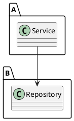
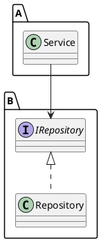
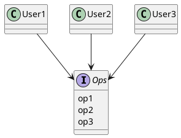
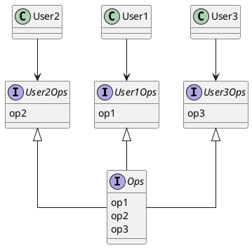

# 設計原則（SOLID）

## SOLID原則とは

SOLID原則とは、以下のような性質を持つ中間レベルのソフトウェア構造を作ることを目的とした設計原則である。

- 変更に強いこと
- 理解しやすいこと
- コンポーネントの基盤として、多くのソフトウェアシステムで利用できること

中間レベルのソフトウェア構造とは、関数やデータ構造をどのようにクラスに組み込むのか、クラスの相互接続をどのようにするのか、などの取り決めのこと。

Robert C. Martinにより提唱された多数のソフトウェア設計の原則を整理して5つにまとめたものの頭文字をとってSOLIDと名付けられた。

### S … Single Responsibility Principle: 単一責任の原則

個々の部品が責任を負う対象は、たったひとつになるようにするべきであるという原則。つまり、将来その部品を改修することになったとして、改修する理由が複数考えられる場合は複数の対象に責任を負っていることになるので、たった一つの対象に責任を負うように部品を適切に分割する必要があるということ。

例えば、以下のような`Employee`クラスはSRPに違反しているといえる。

```typescript
class Employee {
  ...
  public calculatePay(): Money {...};
  public reportHours(): string {...};
  public save(): void {...};
  ...
}
```

- calculatePay … 経理部門が規定する、給与計算のメソッド
- reportHours … 人事部門が規定する、労働時間レポートを出力するメソッド
- save … データベース管理者が規定する、従業員情報をDBに保存するメソッド

このクラスは、給与計算に関わるビジネスルールの変更、レポートのフォーマットの変更、データベーススキーマの変更のどれかがあるたびに変更を加える必要がある。このとき、給与計算に関わるビジネスルールが変更されただけなのにレポートの出力が影響を受ける可能性があるなどの問題がある。また、`Employee`に依存するクラスもすべてこれらの変更に影響される可能性がある。

この問題を解決するには、以下のように。責任ごとにクラスを適切に分割すれば良い。

```typescript
class Employee {
  public calculatePay(): Money {...};
}

class EmployReporter {
  public reportHours(e: Employee): string {...};
}

class EmployeeRepository {
  public save(e: Employee): void {...};
}
```

### O … Open-Closed Principle: 開放閉鎖の原則

ソフトウェアを変更しやすくするために、ソフトウェアの構成要素は拡張に対して開いていて、修正に対して閉じているべきであるという原則。つまり、既存のコードの変更よりも新しいコードの追加によってシステムの振る舞いを変更できるようにするべきであるということ。

以下のような、`Repository`クラスに依存している`Service`クラスの修正について考える。



この関係だと、`Repository`の機能を修正しようとした時、`Repository`を使用している`Service`に影響が及び、`Service`のコードも修正しなければいけない可能性がある。OCPに基づいてこれらの関係を修正すると、以下のようになる。



インターフェース`IRepository`を用意する。`Service`は`IRepository`を使用して、`Repository`は`IRepository`を実装する形にすれば、`Repository`を変更しても`Service`には影響がない形を作ることができる。

このようにして、モジュールの振る舞いを容易に変更でき（Open）、モジュールの振る舞いを変更しても他のモジュールに影響しない（Closed）関係を作ることができる。

### L … Liskov Substitution Principle: リスコフの置換原則

交換可能な部品を使ってソフトウェアシステムを構築するために、部品Tとその派生型である部品Sがあるとき、部品Tが使われている箇所はすべて部品Sで置換可能になるように部品Sはつくられているべきであるという原則。

インターフェースTの実装であるS1やS2の呼び出し方はTの呼び出し方と同様で、S1固有の呼び出し方やS2固有の呼び出し方があってはならない。S1固有の呼び出し方やS2固有の呼び出し方を定義したい場合、それはTで定義するべきである。

また、Tで決められた返り値や副作用はS1とS2で必ず実装されていなければならない。Tで文字列を返すメソッドを定義しているのであれば、S1やS2でそのメソッドを数値を返すような実装にしてはいけない。

### I … Interface Segregation Principle: インターフェース分離の原則

汎用的に使える1つのインターフェースは、特定のクライアント向けの多数のインターフェースに分割されるべきであるという原則。

例えば以下のようなインターフェースはISPに違反している。



このとき、User1のソースコードは、実際は使っていないop2とop3に依存していることになる。インターフェースのop2に変更が生じた場合、本来であれば、op2を使用していないUser1は気にする必要はないはずである。しかし、op2を使用できる状態になっている以上、op2の変更の影響を受ける可能性が生まれてしまう。

以下のようにインターフェースを分離することで、この問題は解消できる。



### D … Dependency Inversion Principle: 依存性逆転の原則

上位レベルの実装コード（より抽象的なものを取り扱うコード）は、下位レベルの実装コード（より具体的なものを取り扱うコード）に依存してはならないという原則。

## ユースケース

### SRPと単純なファイル分割との違い

### OCPの実例

### LSPに違反した場合に生じる不都合

### ISPのメリット

### DIPを用いるタイミング
