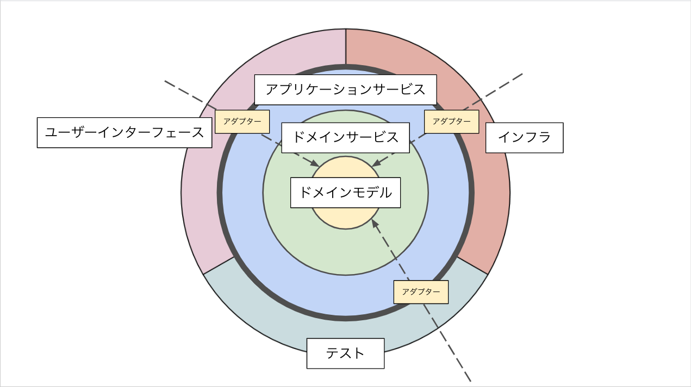

# オニオンアーキテクチャを学ぶ

## 課題1

### オニオンアーキテクチャの図解

#### オニオンアーキテクチャとは

DDDにおけるモデルを具体的に表現するアーキテクチャパターンの一つ。ドメインモデルの独立性を高め、変更に強い・理解しやすいつくりにすることを目的にしている。

図示してある円の外側から内側の一方向にしか依存関係がないようになっている。

#### ドメインモデル

ドメインの概念を知識として落とし込み、それをコードで表現したもの。ドメインモデルはドメイン特有の値や振る舞いを持ち、何にも依存しておらず、独立している。

#### ドメインサービス

ドメインモデルをオブジェクトとして表現したときに、オブジェクトに持たせるのが不自然な振る舞いがあった場合、それはドメインサービスとして表現される。ドメインサービスはドメインモデルのみを用いて表現する。

#### アプリケーションサービス

ソフトウェアとして利用者の問題を解決するために、ドメインモデルやドメインサービスを使ってユースケースを組み立てる。

#### ユーザーインターフェース、インフラ、テスト

アプリケーション層とその外側との間には境界があり、境界の外側にあるユーザーインターフェース、インフラ、テストなどは、ドメイン知識とは関係ないものとして扱われる。ドメイン知識とは関係ないものは、それぞれ専用のアダプターを通じてアプリケーション層とやりとりする。

### ドメインモデルがどの層にも依存していないことによるメリット

- ドメイン知識の変更以外の理由でドメインに関するコードを修正する必要がなくなる
- DBなどのドメイン知識以外の要素がコードに入り込まなくなるので、コードが読みやすくなる
- DBなどのドメイン知識以外の要素によるしがらみがなくなるので、コードが変更しやすくなる

### 層をまたいだ依存をインターフェースに対する依存のみにすることのメリット

- これさえ一致していればよいというインターフェースがあれば、実装のリファクタや新機能追加がしやすい
- モジュールの実装が用意できていなくても、インターフェースがあればより高いレイヤーのコードが書ける

### オニオンアーキテクチャにおける「依存性の逆転」の使い所

処理の流れとしてはアプリケーション層からユーザーインターフェースやインフラの層の向きになるが、間にインターフェースをかませることで、ソースコードの依存性の向きを処理の流れの向きと逆向きにしている。

### アクセス制限機能はどの層に追加するべきか

ドメイン層もしくはドメインサービス層に書くべきである。ユーザーによって可能な操作と不可能な操作があるということは、ユーザーにも種類（アカウントを持っているか、持っていないか、など）があり、ユーザーの種類という知識は、明らかにドメイン知識であると考えられるため。

### DBMSを変更する場合、どの層を変更するべきか

インフラ層に書かれている、実際のDBに対する接続情報や操作について変更する必要がある。また、アプリケーション層とインフラ層との間にあるアダプター（インターフェース）を、変更するDBMSを扱うためのものとして新しく用意する。

## 課題2

### クイズ1

オニオンアーキテクチャは[伝統的なレイヤードアーキテクチャ](https://qiita.com/kichion/items/aca19765cb16e7e65946)の何を解決したと言えるか。

  
回答例

  ドメイン層がインフラ層の変更による影響を受けなくなった。

### クイズ2

ドメインモデルではなくドメインサービスに書かれるようなロジックの例を1つ考えてみてください。

  
回答例

  重複が許されないユーザーの要素があるシステムにおいて、作成しようとしているユーザーが他と重複していないことを確認する処理。
  Userクラスに重複確認のメソッド`isExists`などを用意したとしても、`user.isExists(user)`のように、ユーザー自身に重複を確認するという違和感のある処理になってしまう、`UserService`のようなユーザーのドメインサービスを用意して、そのクラスに`isExists`をもたせるとよい。

### クイズ3

アダプターは、アプリケーション層とユーザーインターフェース・インフラの層のどちらに書くべきか。

  
回答例

  ユーザーインターフェース・インフラの層。

