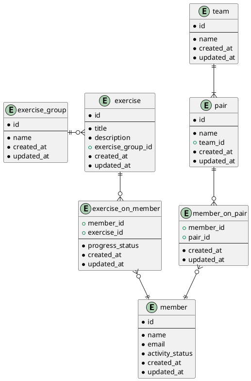

# プラハチャレンジAPIサーバ　ER図

```plantuml
@startuml

Entity member {
  *id
  --
  *name
  *email
  *activity_status
  *created_at
  *updated_at
}
Entity member_on_pair {
  +member_id
  +pair_id
  --
  *created_at
  *updated_at
}
Entity pair {
  *id
  --
  *name
  +team_id
  *created_at
  *updated_at
}
Entity team {
  *id
  --
  *name
  *created_at
  *updated_at
}
Entity exercise {
  *id
  --
  *title
  *description
  +exercise_group_id
  *created_at
  *updated_at
}
Entity exercise_group {
  *id
  --
  *name
  *created_at
  *updated_at
}
Entity exercise_on_member {
  +member_id
  +exercise_id
  --
  *progress_status
  *created_at
  *updated_at
}

team ||--|{ pair
pair ||--o{ member_on_pair
member_on_pair }o--|| member
exercise_on_member }o--|| member 
exercise ||--o{ exercise_on_member 
exercise_group ||-o{ exercise

@enduml
```
