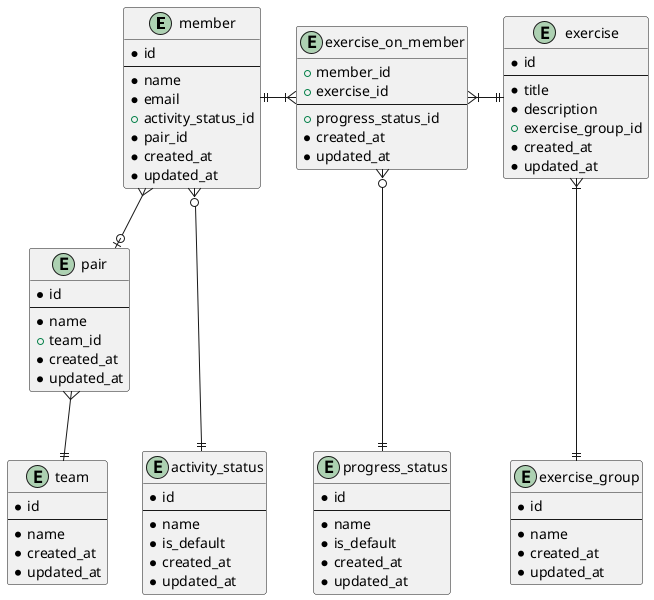

# プラハチャレンジAPIサーバ　ER図

```plantuml
@startuml

Entity member {
  *id
  --
  *name
  *email
  +activity_status_id
  *pair_id
  *created_at
  *updated_at
}
Entity pair {
  *id
  --
  *name
  +team_id
  *created_at
  *updated_at
}
Entity team {
  *id
  --
  *name
  *created_at
  *updated_at
}
Entity activity_status {
  *id
  --
  *name
  *is_default
  *created_at
  *updated_at
}
Entity exercise {
  *id
  --
  *title
  *description
  +exercise_group_id
  *created_at
  *updated_at
}
Entity exercise_group {
  *id
  --
  *name
  *created_at
  *updated_at
}
Entity progress_status {
  *id
  --
  *name
  *is_default
  *created_at
  *updated_at
}
Entity exercise_on_member {
  +member_id
  +exercise_id
  --
  +progress_status_id
  *created_at
  *updated_at
}

member ||-|{ exercise_on_member
exercise_on_member }|-|| exercise
member }--o| pair
member }o---|| activity_status
exercise }|---|| exercise_group
pair }--|| team
exercise_on_member }o---|| progress_status
@enduml
```
