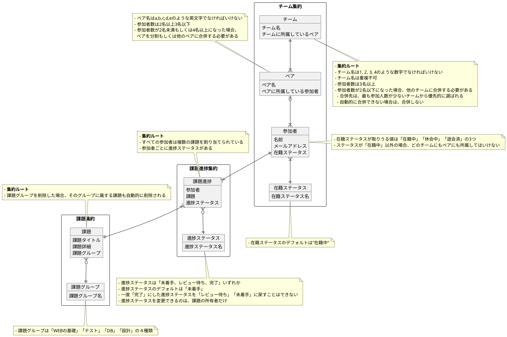

# プラハチャレンジAPIサーバ ドメインモデル図

```plantuml
@startuml

rectangle チーム集約 {
  Object チーム {
    チーム名
    チームに所属しているペア
  }
  Object ペア {
    ペア名
    ペアに所属している参加者
  }
  Object 参加者 {
    名前
    メールアドレス
    在籍ステータス
  }
  Object 在籍ステータス {
    在籍ステータス名
  }
}

rectangle 課題進捗集約 {
  Object 課題進捗 {
    参加者
    課題
    進捗ステータス
  }
  Object 進捗ステータス {
    進捗ステータス名
  }
}

rectangle 課題集約 {
  Object 課題 {
    課題タイトル
    課題詳細
    課題グループ
  }
  Object 課題グループ {
    課題グループ名
  }
}

チーム ||--|{ ペア
ペア |o--|{ 参加者
参加者 }|--|| 在籍ステータス
参加者 ||--|{ 課題進捗
課題進捗 }|--|| 課題
課題進捗 }o--|| 進捗ステータス
課題 }o--|| 課題グループ

note right of 参加者
- 在籍ステータスが取りうる値は「在籍中」「休会中」「退会済」の3つ
- ステータスが「在籍中」以外の場合、どのチームにもペアにも所属してはいけない
endnote

note top of ペア
- ペア名はa,b,c,d,eのような英文字でなければいけない
- 参加者数は2名以上3名以下
- 参加者数が2名未満もしくは4名以上になった場合、
  ペアを分割もしくは他のペアに合併する必要がある
end note

note bottom of チーム
- **集約ルート**
- チーム名は1, 2, 3, 4のような数字でなければいけない
- チーム名は重複不可
- 参加者数は3名以上
- 参加者数が2名以下になった場合、他のチームに合併する必要がある
  - 合併先は、最も参加人数が少ないチームから優先的に選ばれる
  - 自動的に合併できない場合は、合併しない
end note

note bottom of 在籍ステータス
- 在籍ステータスのデフォルトは"在籍中"
end note

note top of 課題
- **集約ルート**
- 課題グループを削除した場合、そのグループに属する課題も自動的に削除される
end note

note bottom of 課題グループ
- 課題グループは「WEBの基礎」「テスト」「DB」「設計」の４種類
end note

note top of 課題進捗
- **集約ルート**
- すべての参加者は複数の課題を割り当てられている
- 参加者ごとに進捗ステータスがある
end note

note bottom of 進捗ステータス
- 進捗ステータスは「未着手、レビュー待ち、完了」いずれか
- 進捗ステータスのデフォルトは「未着手」
- 一度「完了」にした進捗ステータスを「レビュー待ち」「未着手」に戻すことはできない
- 進捗ステータスを変更できるのは、課題の所有者だけ
end note

@enduml
```
