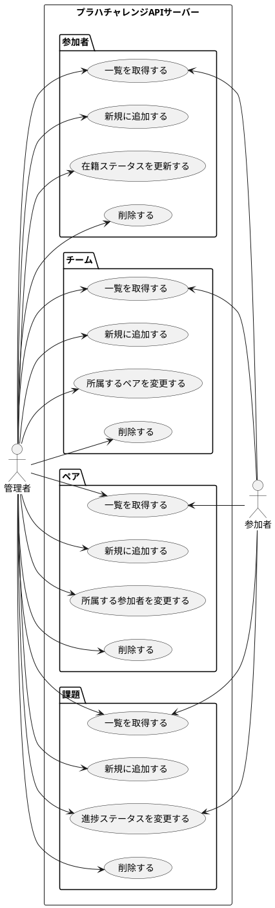

# プラハチャレンジAPIサーバ ユースケース図

```plantuml
@startuml

left to right direction

actor 管理者 as admin
actor 参加者 as member

rectangle プラハチャレンジAPIサーバー {
  package 参加者 as members {
    usecase "一覧を取得する" as uc1_1
    usecase "新規に追加する" as uc1_2
    usecase "在籍ステータスを更新する" as uc1_3
    usecase "削除する" as uc1_4
    uc1_4 -[hidden] uc1_3
    uc1_3 -[hidden] uc1_2
    uc1_2 -[hidden] uc1_1
  }
  package チーム as teams {
    usecase "一覧を取得する" as uc2_1
    usecase "新規に追加する" as uc2_2
    usecase "所属するペアを変更する" as uc2_3
    usecase "削除する" as uc2_4
    uc2_4 -[hidden] uc2_3
    uc2_3 -[hidden] uc2_2
    uc2_2 -[hidden] uc2_1
  }
  package ペア as pairs  {
    usecase "一覧を取得する" as uc3_1
    usecase "新規に追加する" as uc3_2
    usecase "所属する参加者を変更する" as uc3_3
    usecase "削除する" as uc3_4
    uc3_4 -[hidden] uc3_3
    uc3_3 -[hidden] uc3_2
    uc3_2 -[hidden] uc3_1
  }
  package 課題 as practices {
    usecase "一覧を取得する" as uc4_1
    usecase "新規に追加する" as uc4_2
    usecase "進捗ステータスを変更する" as uc4_3
    usecase "削除する" as uc4_4
    uc4_4 -[hidden] uc4_3
    uc4_3 -[hidden] uc4_2
    uc4_2 -[hidden] uc4_1
  }
}


admin --> uc1_1
admin --> uc1_2
admin --> uc1_3
admin --> uc1_4
admin --> uc2_1
admin --> uc2_2
admin --> uc2_3
admin --> uc2_4
admin --> uc3_1
admin --> uc3_2
admin --> uc3_3
admin --> uc3_4
admin --> uc4_1
admin --> uc4_2
admin --> uc4_3
admin --> uc4_4
uc1_1 <-- member
uc2_1 <-- member
uc3_1 <-- member
uc4_1 <-- member
uc4_3 <-- member

@enduml
```
