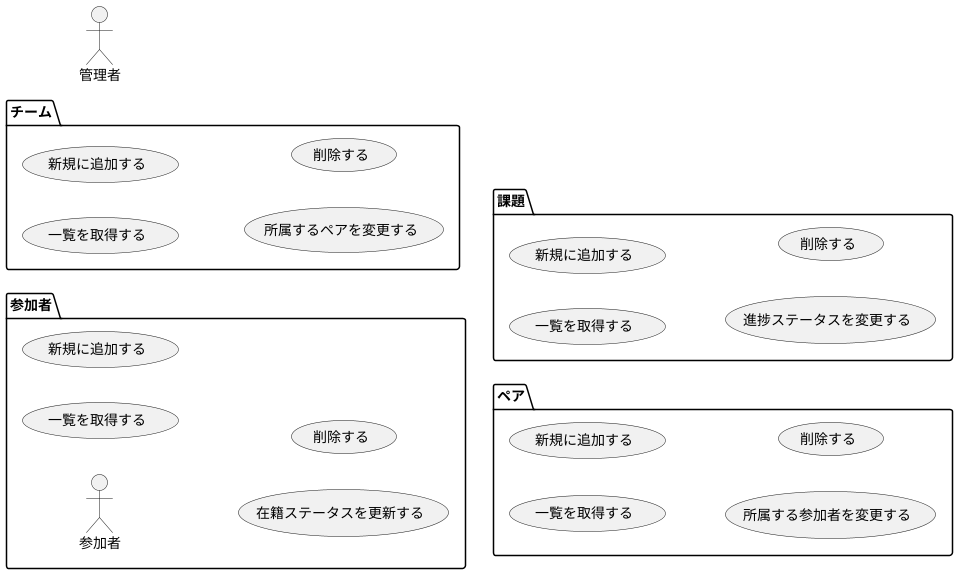

# プラハチャレンジAPIサーバ ユースケース図

```plantuml
@startuml

left to right direction

actor 管理者 as admin

package 参加者 {
  actor 参加者 as member
  usecase "一覧を取得する" as uc1_1
  usecase "新規に追加する" as uc1_2
  usecase "在籍ステータスを更新する" as uc1_3
  usecase "削除する" as uc1_4
}
package チーム {
  usecase "一覧を取得する" as uc2_1
  usecase "新規に追加する" as uc2_2
  usecase "所属するペアを変更する" as uc2_3
  usecase "削除する" as uc2_4
}
package ペア {
  usecase "一覧を取得する" as uc3_1
  usecase "新規に追加する" as uc3_2
  usecase "所属する参加者を変更する" as uc3_3
  usecase "削除する" as uc3_4
}
package 課題 {
  usecase "一覧を取得する" as uc4_1
  usecase "新規に追加する" as uc4_2
  usecase "進捗ステータスを変更する" as uc4_3
  usecase "削除する" as uc4_4
}

@enduml
```
