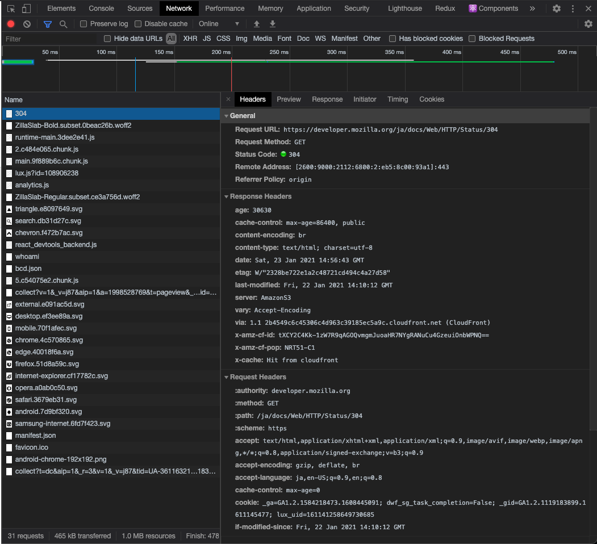
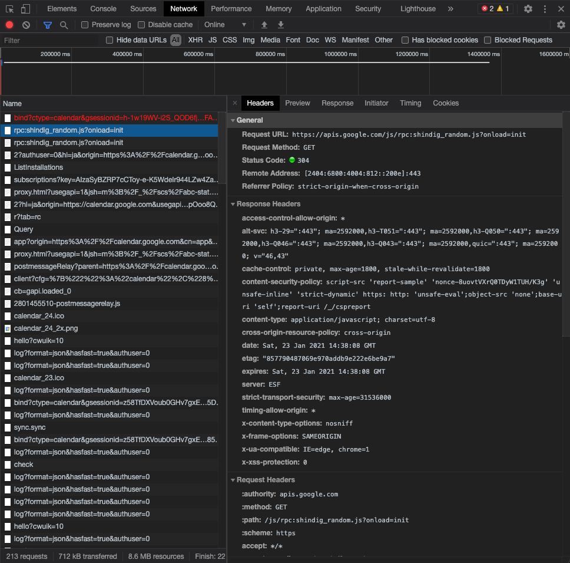
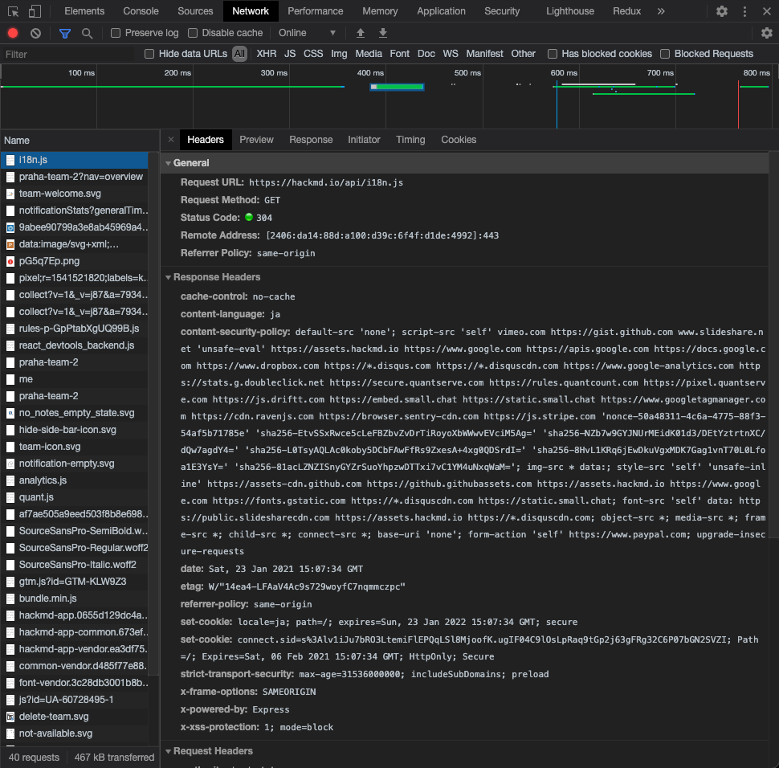

# キャッシュについて理解する

## HTTPキャッシュの概要

過去に取得したリソースを再利用することで、ウェブサイト・ウェブアプリケーションのパフォーマンスを向上させるための仕組み。

キャッシュの仕組みとして、まず、提供されたリソースの複製をキャッシュのストアに保存しておく。そして、同じリソースが再度要求された時、リクエストに介入し、提供元のサーバーから再びリソースをダウンロードする代わりにキャッシュ内の複製のデータを返す。これによりサーバーは、対応すべきクライアントの数が減るため、負荷が軽減する。クライアントの視点から見ると、リソースがサーバーよりも近いところ（キャッシュストア）にあるため、リソースを受け取るための時間が短くなる。

### キャッシュ処理の対象

一般的なHTTPキャッシュは、GETのレスポンスのみキャッシュするように制限されている。

- 200レスポンスに含まれるhtml文書、画像、ファイルなどのリソース
- 301レスポンスによる恒久的なリダイレクト
- 404レスポンスによるNot Foundのページ
- 206レスポンスによる不完全な結果

### HTTPキャッシュの種類

#### プライベートキャッシュ

ひとりのユーザーのためのキャッシュ。ブラウザーのキャッシュストアに保存されている。ユーザーがHTTPでダウンロードしたすべての文書を保持する。ブラウザーの「戻る/進む」「ページの保存」「ソースの表示」などの機能は、プライベートキャッシュを利用しているため、サーバーとの追加のやり取りする必要なしに実現している。

#### 共有キャッシュ

複数のユーザーによって利用されるキャッシュ。多くのユーザーから頻繁にアクセスされるリソースは、プロキシサーバーにキャッシュとして保存しておくことで、サーバーの負荷を低減できる。

### キャッシュが利用可能かどうかの確認

キャッシュは有限の記憶領域のため、アイテムは定期的に記憶領域から削除される必要がある。リソースが更新されてもサーバーからクライアントに通知を飛ばすことはできないため、クライアントからサーバーにキャッシュが利用可能かどうかの確認をする必要がある。クライアントは、リクエストにHTTPヘッダ`If-None-Match:<etag_value>`を設定し、識別子ETag（ETagについては後述）に一致するリソースがあるかどうかをサーバーに確認する。ETagに一致するリソースが存在すれば、サーバーは要求されたリソースを送信せずに 304 (Not Modified) ヘッダーを返す。

## HTTPヘッダによるHTTPキャッシュの制御

### Cache-Controlヘッダ

#### キャッシュしない制御

HTTPヘッダに`Cache-Control: no-store`を設定することで、HTTPリクエスト・レスポンスはキャッシュに保存されなくなる。リクエストは毎回サーバーに送信され、レスポンスはリクエストごとに毎回サーバーから送信される。

#### キャッシュを返却する前に毎回再検証する

HTTPヘッダに`Cache-Control: no-cache`を設定することで、キャッシュを渡す前に毎回「キャッシュのリソースが最新か」リクエストがサーバーへ送られるようになる。

#### プライベートキャッシュか共有キャッシュかを決める

HTTPヘッダに`Cache-Control: private`を設定することで、レスポンスがユーザー一人のためのものであり、共有キャッシュに保存してはならないことを示すことができる。

一方、`Cache-Control: public`を設定することで、どのようなキャッシュでも（共有キャッシュであっても）レスポンスを保存してよいことを示すことができる。

#### 有効期限を設定する

HTTPヘッダに`Cache-Control: max-age=<seconds>`を設定することで、キャッシュの有効期限を設定できる。有効期限が切れたキャッシュは削除されたり無視されたりすることはないため、取り扱いを定義する必要がある。

#### 有効期限が切れている場合、再検証する

HTTPヘッダに`Cache-Control: must-revalidate`を設定すると、キャッシュの有効期限が切れていた場合、「キャッシュのリソースが最新か」リクエストがサーバーに送信される。

### ETagヘッダ

`Etag`ヘッダには、リソースを特定するための識別子を設定できる。サーバーは`ETag`の値を参照することで、リソースが更新されているかどうかを判断しデータを再送するか否かを決定できる。

## ブラウザのキャッシュサイズの上限

ブラウザのストレージの最大容量は、ハードディスクの空き容量の50%で、これをグローバルリミットと呼ぶ。キャッシュの生成元であるドメインには、グローバルリミットの20%のみストレージを使用できるという制限もあり、これをグループリミットと呼ぶ。

使用可能なストレージの領域が全て埋まったときは、最も過去に使用された生成元のデータがはじめに削除され、上限を下回るまで削除を繰り返す。これをLRUポリシーと呼ぶ。

## HTTPキャッシュ仕様の実例

### MDN Web Docs

記事ページのhtmlを、24時間の有効期限付きでキャッシュしている。また、`public`が設定されているので、プライベートキャッシュではなく共有キャッシュである可能性がある。

### Googleカレンダー

なんの処理かは不明だが、JavaScriptファイルを30分間の有効期限付きでキャッシュしている。また、`stale-with-revalidate=1800`が設定されているため、30分おきに新しいレスポンスが非同期にチェックされる。

### HackMD

詳細は不明だが、ファイル名から察するに、国際化対応のためのJavaScriptファイルがキャッシュされている。

## どのようなデータをキャッシュすべきか

### 消去されても問題ないデータ

キャッシュは、以下のような原因で消失しやすいデータである。

- 有効期限が切れる
- ストレージの空き容量が足りなくなって削除される
- ユーザーによって削除される

そのため、消去されることによってアプリケーションが正常に機能されなくなるようなデータは、キャッシュすべきではない。

### 読み込み頻度が高いデータ

読み込み頻度が高いほど、キャッシュによって節約されるトラフィックや読み込み時間は多くなるため、キャッシュから受ける恩恵は大きくなる。

### 書き込み頻度が低いデータ

データの更新が多くなると、そのぶんキャッシュの整合性を保つためのコストがかかるため、書き込み頻度が高いデータをキャッシュするのは避けたほうがよい。
